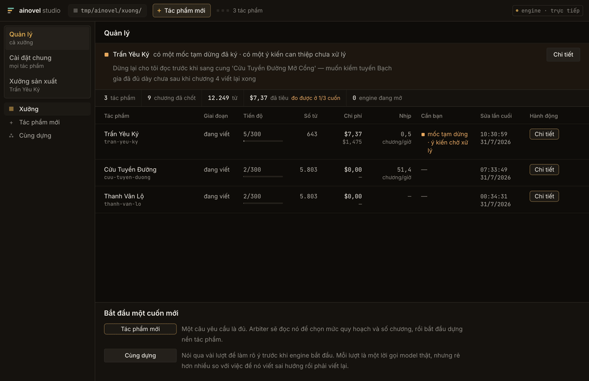
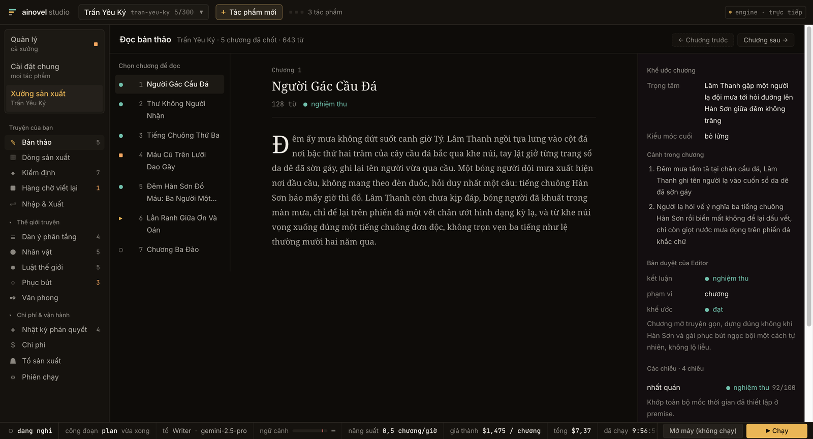
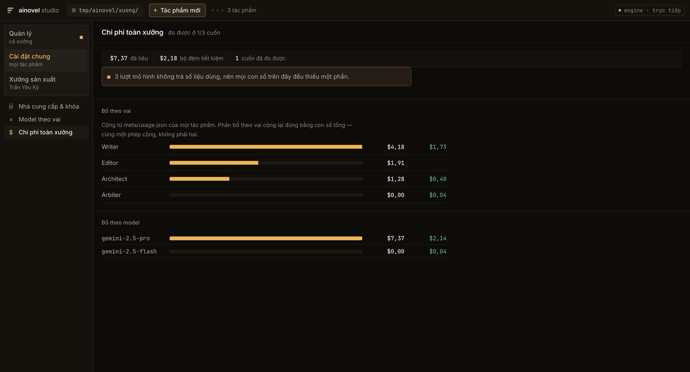
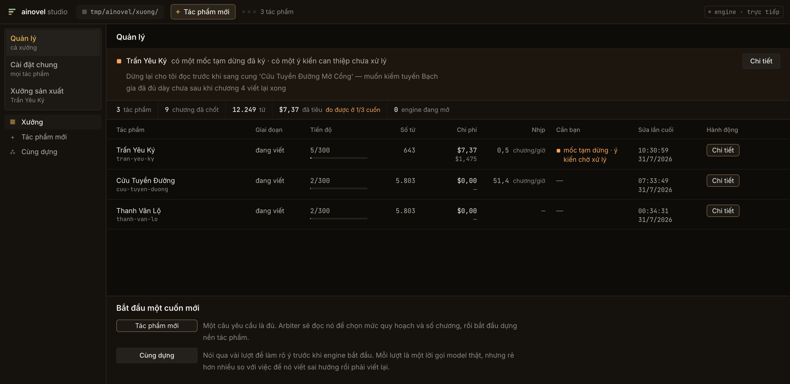

# ainovel-cli

**English** · [Tiếng Việt](README.md)

A fully autonomous AI engine for writing long-form novels. A deterministic engine drives an
entire book end to end and calls the model only where judgement is actually required: the
Engine routes on facts to coordinate three autonomous authoring agents — Architect / Writer /
Editor — and wakes an Arbiter when a semantic ruling is needed. One sentence of intent in, one
finished novel out, with no human in the loop.

> ### This is a fork
>
> This repository is a **Vietnamese-localised fork** of
> [voocel/ainovel-cli](https://github.com/voocel/ainovel-cli). **The engine, the architecture
> and the original design belong to the upstream project** — this fork did not invent them.
>
> Read [Credits](#credits) for the full lineage before citing this repo as the source of any
> idea described below.

<p align="center">
  
</p>

<p align="center">
  <sub>The web studio on real data from an actual run: <b>Management</b> across the whole floor →
  a single book's <b>production line</b> → <b>draft</b> → <b>floor-wide cost</b> →
  <b>per-role models</b>. The running interface is Vietnamese; see the language note below.</sub>
</p>

<table>
<tr>
<td width="50%" valign="top">
  
  <sub><b>Reading a draft.</b> An accepted chapter sits next to its chapter contract and the
  Editor's seven-dimension review — every dimension has to quote the text as evidence.</sub>
</td>
<td width="50%" valign="top">
  
  <sub><b>Floor-wide cost.</b> Split by role and by model. When a model call returns no usage
  figures, the studio says the total is short rather than quietly adding up the wrong number.</sub>
</td>
</tr>
</table>

> **A note on language.** The default UI language is **Vietnamese**, and the prompts are
> localised so the model writes Vietnamese prose. `AINOVEL_LANG=zh` returns the CLI/TUI to
> upstream's original Chinese strings. **There is no English UI yet** — see
> [Internationalisation](#internationalisation) for exactly what exists and what does not.
> This README is in English; the running program is not.

---

## Features

- **Deterministic engine + cooperating agents** — the Engine dispatches Architect / Writer /
  Editor from a fact-based decision table. The main loop spends *zero* LLM calls and its
  behaviour is exhaustively testable.
- **Auditable semantic rulings** — picking an architect, classifying a user intervention,
  choosing a way out of a dead end: each is one Arbiter call. Every ruling is written to disk
  and can be replayed.
- **Step-level checkpoint recovery** — every finished tool call writes a checkpoint. After a
  crash the run resumes at the exact plan/draft/check/commit step.
- **Two-tier progressive planning (volume → arc)** — long novels are not planned all at once.
  Only the first two volumes' skeleton plus arc 1's chapters are planned up front; later arcs
  are expanded by the Architect when the writing reaches them, always against prior summaries
  and character state.
- **Smart related-chapter recall** — for each chapter the system surfaces related history along
  four axes: foreshadowing, characters present, state changes, relationships — plus a forecast
  of the next chapter. This is what keeps a 500+ chapter novel coherent.
- **Adaptive context strategy** — switches between full context, sliding window and tiered
  summaries based on total chapter count.
- **Seven-dimension quality review** — the Editor reviews setting consistency, character
  behaviour, pacing, narrative continuity, foreshadowing, hooks, and aesthetic quality. The
  aesthetic axis splits further into five sub-scores, each of which must quote the text as
  evidence.
- **Real-time steering** — inject a correction at any time while writing, without pausing. The
  system assesses the blast radius and rewrites the affected chapters.
- **Optional per-chapter acceptance** — fully automatic by default; `/review on` makes each
  `/next` release exactly one new chapter.
- **Unified TUI** — an interactive surface that follows progress live, or takes a one-line
  brief and starts immediately.
- **Web studio** — `ainovel-cli serve --web <dir>` opens a full operating surface over the
  store. See [Web studio](#web-studio).
- **Multi-LLM** — OpenRouter / Anthropic / Gemini / OpenAI and others, switchable.

## Architecture

The core split: **deterministic at the fact layer, autonomous at the semantic layer.**
Enumerable state transitions are executed by deterministic code (Engine + Route); bounded
judgements are asked of an LLM function on demand (Arbiter); open-ended authoring is handed to
autonomous LLM loops (Workers).

```
┌────────────────────────────────────────────────────────────────┐
│                  Host / Engine (deterministic)                 │
│  read Store → Route → run Worker directly → loop               │
│  start ruling / steer classification / deadlock → Arbiter      │
└─────┬────────────┬────────────┬────────────┬───────────────────┘
      │            │            │            │
 ┌────▼────┐  ┌────▼────┐  ┌────▼────┐  ┌────▼────┐
 │Architect│  │ Writer  │  │ Editor  │  │ Arbiter │
 │ LLM loop│  │ LLM loop│  │ LLM loop│  │ LLM func│
 └────┬────┘  └────┬────┘  └────┬────┘  └─────────┘
      └────────────┼────────────┘
                   │ tool calls (IO + checkpoint)
┌──────────────────▼─────────────────────────────────────────────┐
│                             Store                              │
│  Progress / Checkpoint / Outline / Drafts / ...                │
└────────────────────────────────────────────────────────────────┘
```

- **Engine** — each turn reads facts from the Store and dispatches via the Route decision
  table. It decides execution, never literary merit. Crash recovery is "read the store and
  keep going"; there is no session to restore.
- **Arbiter** — on-demand semantic rulings. Facts in, structured decision out, every ruling
  persisted so it can be audited and replayed.
- **Workers** — Architect / Writer / Editor are autonomous authoring loops, each with its own
  context, cooperating only through artefacts in the Store.
- **Tools** — atomic single-file IO with replay invariants. Chapter submission uses a durable
  saga plus checkpoints, and returns **only facts** as JSON — never an instruction string.

## Quick start

```bash
# One-line install (macOS / Linux, no Go required)
curl -fsSL https://raw.githubusercontent.com/voocel/ainovel-cli/main/scripts/install.sh | sh

# Or via Go
go install github.com/voocel/ainovel-cli/cmd/ainovel-cli@latest

# First run walks you through provider → API key → base URL → model
ainovel-cli
```

> ### ⚠️ The commands above install UPSTREAM, not this fork
>
> `install.sh` hardcodes `REPO="voocel/ainovel-cli"`, and `go install
> github.com/voocel/ainovel-cli/...` resolves through `go.mod` to upstream as well. Both give
> you the **original**, which has neither the Vietnamese localisation nor the web studio.
>
> To run *this* fork, build from source:
>
> ```bash
> git clone https://github.com/huuhoa143/ainovel-cli && cd ainovel-cli
> go build -o ainovel-cli ./cmd/ainovel-cli
> cd web && npm ci && npm run build && cd ..   # only if you want the web studio
> ./ainovel-cli serve --web web/out
> ```
>
> This is a known open item rather than a documentation slip: fixing it means either changing
> the module path or publishing fork-specific releases — a call that has not been made yet.

The first run generates `~/.ainovel/config.json`. Inside the TUI, `/config` adds or edits
providers and per-model context windows; `/model` switches between saved models. A reference
file lives at `config.example.jsonc` in the repo root.

### Docker

```bash
# TUI
docker run -it --rm -v "$PWD/output:/app/output" -v "$HOME/.ainovel:/root/.ainovel" \
  ghcr.io/voocel/ainovel-cli:latest
```

## Web studio

Besides the TUI, this fork ships a **web operating surface** served straight off the store:

```bash
# API only (127.0.0.1:8420), reading novels under ./output
ainovel-cli serve

# With the built UI
ainovel-cli serve --web ./web/out

# Different root, or serve exactly one novel
ainovel-cli serve --root ./output --book my-novel --addr 127.0.0.1:8420
```

The studio covers the **whole lifecycle** — create a novel, run it, steer it, accept chapters
one by one, set the API key, change per-role models, import outside text, export — without
opening a terminal.

### Three screens

Navigation has two tiers: **screen** on top, **zone** underneath. All three screens are always
visible at the top of the left rail.

| Screen | Scope | Contains |
|---|---|---|
| **Quản lý** (Manage) | whole workshop | novel list · what needs you · workshop totals · new novel · co-draft |
| **Cài đặt chung** (Shared settings) | every novel | provider & key · default model per role · workshop-wide cost |
| **Xưởng sản xuất** (Production) | one novel | 13 authoring and operations zones for the open novel |

Manage is the landing screen. `?tp=<novel>` in the URL opens that novel's production screen
directly; `?khu=<zone>` wins over both.

<p align="center">
  
</p>

<p align="center">
  <sub>The <b>Manage</b> screen. The strip at the top appears only when something genuinely waits
  on a person — here, a signed hold quoting the operator's own reason, and one steering note that
  has not been processed yet.</sub>
</p>

**Changing screen changes the whole frame, not just the canvas.** The book picker appears only
on the production screen; the other two show the workshop root. The transport bar — which
carries a real money-spending `Run` button — exists only on the production screen, because a
per-novel control has no business sitting under a surface that lists every novel.

### Safety rails

The engine runs **in the same process** as the studio, so the studio is the single writer and
every write goes through `*host.Host` — the same transactions the engine uses for itself. Two
rails come with that:

- **File-level lock** (`meta/studio.lock`). `store.IO.WithWriteLock` is only an in-process
  mutex, so it cannot see another process. The TUI still runs, so this lock is what stops both
  sides opening the same novel. It names the holding PID and the file to delete if orphaned.
- **Writes only on loopback.** Since the studio holds the API key and can start the engine, a
  request from a stranger could spend real money. If `--addr` is not loopback, the write routes
  are **not mounted at all** and the studio falls back to read-only. A CSRF rail (custom header
  plus `Origin`/`Host` checks) guards localhost, because any open web page can reach
  `127.0.0.1`.

The API key is **write-only**: settable through the UI, never returned. Where it must be shown,
it is masked (`sk-4…802`).

### One engine at a time

`boMay.soToiDa == 1` — the engine opens **exactly one** novel at a time; a second returns
`errQuaNhieuMay`. "Batch production" therefore means *managing* many novels with a clear
priority queue, **not** running them in parallel. The Manage screen deliberately does not draw
a parallel-run dashboard, because drawing a queue for a mechanism that does not exist promises
something that will not run.

## Internationalisation

**Short version: Vietnamese and Chinese, no English, and the web studio is not
internationalised at all.**

| Surface | Languages | Mechanism |
|---|---|---|
| CLI + TUI | `vi` (default), `zh` (upstream source) | `internal/i18n/`, 2,028 call sites, 1,821 catalog entries |
| Web studio | `vi` only | none — strings hardcoded in `web/lib/nhan.ts` |

`AINOVEL_LANG=zh` reverts the CLI/TUI to upstream's original strings. It does **not** affect
the web studio: `internal/serve/` and `web/` are new fork code with no Chinese original to fall
back to.

Adding a language is documented — including why it is more than a translation job for the web
UI — in **[docs/i18n.md](docs/i18n.md)**.

## Design philosophy

> **Deterministic at the fact layer, autonomous at the semantic layer.** The model is free
> where nothing can be verified (what to write, how to write it) and constrained where things
> can be (ordering, invariants, phases).

- **Enumerable transitions belong in code** — "who runs next" is a table lookup over facts.
  `flow.Route` is a pure function tested exhaustively across tens of thousands of combinations.
- **Bounded judgement belongs to the Arbiter** — facts in, structured decision out, machine
  validation behind it, every ruling persisted and replayable.
- **Open authoring belongs to the Worker** — within a chapter the Writer is fully autonomous;
  failing tools return structured errors with a suggested way out so the LLM can self-correct.
- **Harden boundaries, not judgement** — code guards only provable invariants. It never fakes
  understanding with keyword lists, score thresholds or rule tables.
- **Tools return facts only** — no `[system]` instruction strings smuggled into tool output.
- **Refuse complex orchestration** — no task queue, no policy engine. One sequential loop, one
  decision table, a few ruling functions.
- **Stronger models pay off linearly** — the deterministic shell does not change.

## Tech

- **Go 1.25**
- **[agentcore](https://github.com/voocel/agentcore)** — minimal agent core (tool-calling + streaming)
- **[litellm](https://github.com/voocel/litellm)** — unified LLM adapter layer
- **[Bubble Tea](https://github.com/charmbracelet/bubbletea)** — terminal UI framework
- **Next.js (static export)** — the web studio ships as static files served by the Go binary

## Contributing

This is a fork, which shapes how contributions should be aimed:

- **Engine, architecture, agent behaviour** — these belong upstream. Please send them to
  [voocel/ainovel-cli](https://github.com/voocel/ainovel-cli) so everyone benefits, not just
  this fork.
- **Localisation, the web studio, fork-specific docs** — those live here.

Two conventions worth knowing before you open a PR:

- **Keep the rebase diff small.** The i18n layer uses source strings as msgids specifically so
  this fork can track a fast-moving upstream. Please do not "clean that up" into explicit keys.
- **Comments carry the reasoning.** This codebase documents *why*, often with the measurement
  that motivated a decision. Matching that style is the house norm.

```bash
go test ./internal/...     # Go
cd web && npx vitest run   # web
cd web && npm run build    # static export
```

## Credits

This is a **fork** of [voocel/ainovel-cli](https://github.com/voocel/ainovel-cli). The engine,
the architecture and the original design are upstream's work. **This fork is not the original
project.**

What the fork adds on top of upstream:

- **i18n layer** (`internal/i18n/`) — Vietnamese by default, `AINOVEL_LANG=zh` restores
  upstream's strings
- **Localised prompts / reference material / style guides** in `assets/`, so the model writes
  Vietnamese prose instead of Chinese
- **Web studio** (`internal/serve/` + `web/`) — an HTTP API over the store plus a full
  operating surface; see [Web studio](#web-studio)

The initial translation memory was taken from
[kentjuno/ainovel-cli](https://github.com/kentjuno/ainovel-cli) at commit `68eb92d` — thanks
for their localisation work.

## License

MIT

This project actively participates in and acknowledges the
[linux.do community](https://linux.do/).
